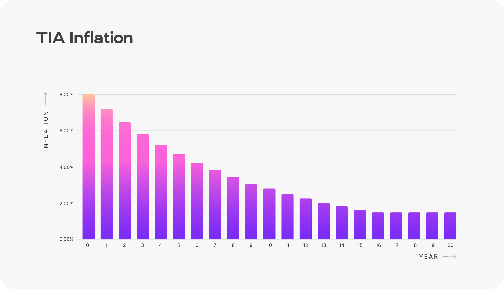
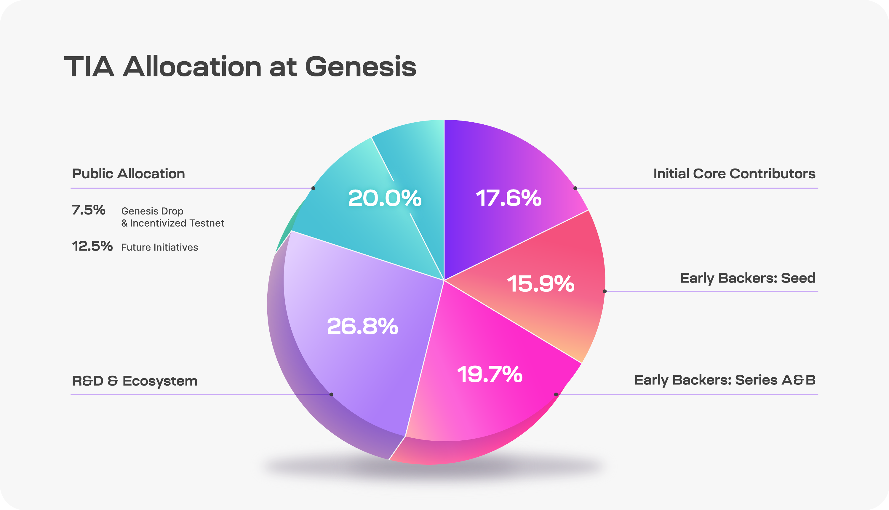

# Staking, governance, & supply

## Proof-of-Stake on Celestia

Celestia is a proof of stake blockchain based on Comet-BFT and the Cosmos-SDK. Celestia supports in-protocol delegation and will start with an initial validator set of 100.

Staking TIA as a validator or delegator enables you to earn staking rewards from the network. Validators charge a fee to delegators which gives them a percentage of staking rewards.

For more details on how proof of stake works on Cosmos SDK chains like Celestia, see
[this document](https://docs.cosmos.network/main/modules/staking#:~:text=The%20module%20enables%20Cosmos%20SDK,validator%20set%20for%20the%20system).

| Property | Details |
| -------- | ------- |
| Consensus Mechanism | Proof-of-Stake (PoS) |
| Blockchain Framework | Cosmos SDK |
| Validator Set Size | 100 |
| Delegation Support | Yes |

## Inflation

TIA inflation starts at 8% annually and decreases by 10% every year
until it reaches the long term issuance rate of 1.5%. Exact annual
inflation rates can be found in the diagram below.

The annual provisions for inflation are calculated based on the
total supply of TIA at the beginning of each year. To calculate how
many TIA to issue per block, Celestia uses the block timestamp
rather than the block height since the time between blocks can vary
and cause actual issuance to be higher than the target.

More details can be found in [ADR019](https://github.com/celestiaorg/celestia-app/blob/main/docs/architecture/adr-019-strict-inflation-schedule.md).

Learn how to stake on your own at the community dashboards
listed [here](../../developers/staking/).

## Governance

### Network parameters

TIA holders (not just stakers) can propose and vote on governance
proposals to change a subset of network parameters. A complete list
of both the changeable and non-changeable parameters and their
values can be found [here](https://github.com/celestiaorg/celestia-app/blob/v1.x/specs/src/specs/params.md).
The process for submitting and voting on governance proposals is available [here](../../nodes/celestia-app-commands/#governance).

### Community pool

Starting at genesis, Celestia’s community pool receives 2% of all Celestia block rewards. TIA stakers may vote to fund ecosystem initiatives as in many other Cosmos SDK chains.

:::warning
TODO: add community pool overview
:::

## Supply

### TIA allocation at genesis

The 1B TIA minted at genesis are split into five categories: Public
Allocation, R&D & Ecosystem, Early Backers: Series A&B, Early
Backers: Seed, and Initial Core Contributors.

### TIA distribution

| Category | Description | Percentage (%) |
| -------- | ----------- | -------------- |
| Public Allocation | Genesis Drop and Incentivized Testnet: 7.5% Future initiatives: 12.5% | 20% |
| R&D & Ecosystem | Tokens allocated to the Celestia Foundation and core devs for research, development and ecosystem initiatives including - Protocol maintenance and development - Programs for rollup developers, infrastructure and node operators | 26.8% |
| Early Backers: Series A&B | Early supporters of the Celestia community | 19.7% |
| Early Backers: Seed | Early supporters of the Celestia community | 15.9% |
| Initial Core Contributors | Members of Celestia Labs, the first core contributor to Celestia | 17.6% |

### Unlocks

The 1B TIA minted at genesis is subject to various lockup schedules
depending on the category. The unlock schedule for each category is
described in the table below.

| Category | Unlock Schedule |
| -------- | --------------- |
| Public Allocation | Fully unlocked at launch. |
| R&D & Ecosystem | 25% unlocked at launch. Remaining 75% unlocks continuously from year 1 to year 4. |
| Initial Core Contributors | 33% unlocked at year 1. Remaining 67% unlocks continuously from year 1 to year 3. |
| Early Backers: Series A&B | 33% unlocked at year 1. Remaining 67% unlocks continuously from year 1 to year 2. |
| Early Backers: Seed | 33% unlocked at year 1. Remaining 67% unlocks continuously from year 1 to year 2. |

**Circulating supply** is defined as the amount of TIA tokens in
general circulation that have no restrictions on transfer.

**Available supply** is defined as the amount of TIA tokens that are
either part of the circulating supply or are unlocked but subject to
some form of governance to determine when the tokens are
distributed. This includes the unlocked portion of the R&D &
Ecosystem tokens and the tokens set aside for future initiatives.

Locked tokens can be staked. All staking rewards will be unlocked.
